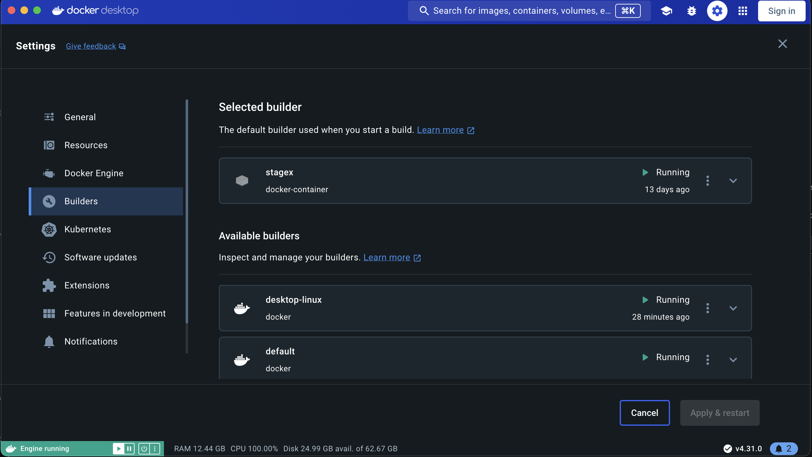
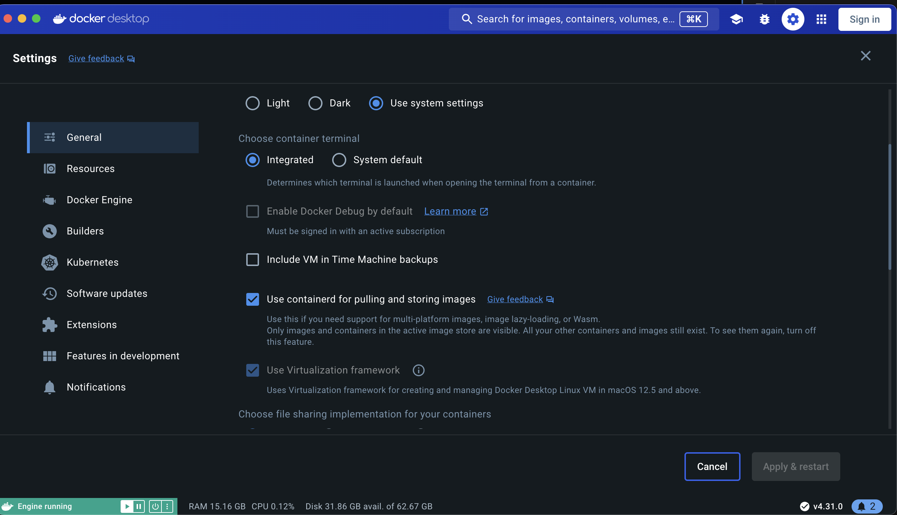
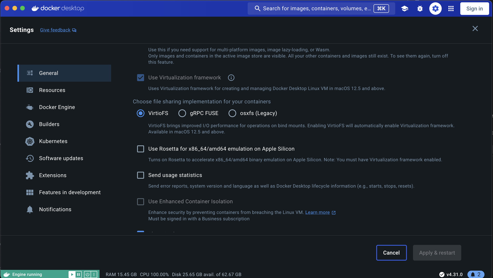

# Aiy Node Deterministic Build

## General Requirements
* Requires Docker `>=v26.0.1`
* OCI-Compliant buildx `docker-container`: 
    * `docker buildx create --driver 'docker-container' --name stagex --use`
    * `docker use --bootstrap stagex`

## MacOS Requirements
* ensure previous requirements, `Builders` should look like:

* in `General`, Enable `containerd for pulling and storing images`

* disable Rosetta

## Build Steps
In Root Directory, run: `./docker/aiy-node-deterministic/build.sh`

Build artifact is output in: `build/oci/aiy-node`

Load the image with the command: `(cd build/oci/aiy-node && tar -c .) | docker load`

## Extract aiy-node Binary

### Find aiy-node binary

Find oci blob with aiy-node binary (it is the largest blob in `build/oci/aiy-node/blobs/sha256`)
`ls -lSh build/oci/aiy-node/blobs/sha256`

### Extract aiy-node Binary

Extract `aiy-node` binary from blob:
`tar xf build/oci/aiy-node/blobs/sha256/<blob-digest>`

### Get digest of aiy-node.

On Linux run:
`sha256sum opt/aiy/bin/aiy-node`

On MacOS run:
`shasum -a 256 opt/aiy/bin/aiy-node`